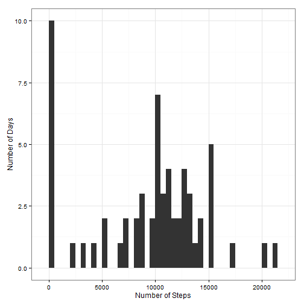
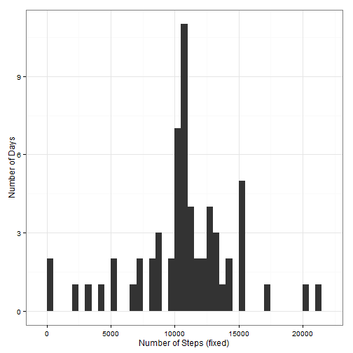
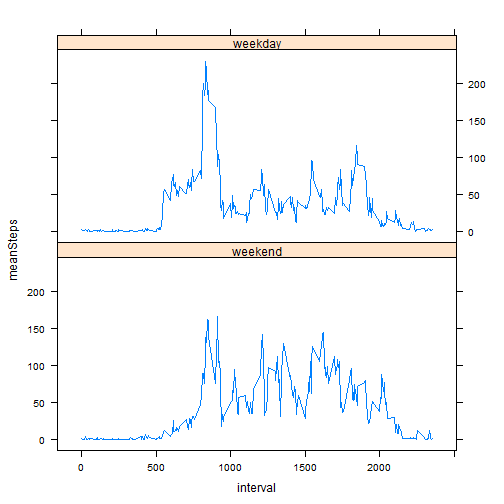

## Loading and preprocessing the data

The first step in this analysis is to read the input dataset into R (note: the activity.zip file was manually decompressed to create an "activity.csv" file).


```r
dt <- fread("activity.csv");

# Check that the data was loaded ok:
summary(dt);
```

```
##      steps            date              interval     
##  Min.   :  0.00   Length:17568       Min.   :   0.0  
##  1st Qu.:  0.00   Class :character   1st Qu.: 588.8  
##  Median :  0.00   Mode  :character   Median :1177.5  
##  Mean   : 37.38                      Mean   :1177.5  
##  3rd Qu.: 12.00                      3rd Qu.:1766.2  
##  Max.   :806.00                      Max.   :2355.0  
##  NA's   :2304
```


## What is mean total number of steps taken per day?


```r
# Generate summary data.table of steps per date:
dtStepsByDate <- dt[,list(stepCount=sum(steps,na.rm=TRUE)),by=date];

# Histogram of total steps per day:
qplot( stepCount,
       data=dtStepsByDate,
       ylab = "Number of Days",
       xlab = "Number of Steps",
       binwidth = 500
     ) + theme_bw();
```

 


```r
# Calculate mean steps per day:
mean(dtStepsByDate$stepCount)
```

```
## [1] 9354.23
```

```r
# Calculate median steps per day:
median(dtStepsByDate$stepCount)
```

```
## [1] 10395
```


## What is the average daily activity pattern?


```r
# calculate summary of mean steps per interval:
dtMeanStepsByInterval <- dt[,list(meanSteps=mean(steps,na.rm=TRUE)),by=interval]

# Plot time-series of average steps per interval:
ggplot(dtMeanStepsByInterval, aes(interval, meanSteps)) + geom_line();
```

 


```r
# Identify 5-min interval with highest step count on average:
dtMeanStepsByInterval[meanSteps == max(dtMeanStepsByInterval$meanSteps),];
```

```
##    interval meanSteps
## 1:      835  206.1698
```

## Imputing missing values


```r
# Determine number of rows with NAs:
nrow(dt[is.na(steps)]);
```

```
## [1] 2304
```


```r
# Make a copy of the data.table so that the fix isn't a	applied to the original data:
dtFix = copy(dt);

# Fill in gaps with values calculated in Mean Steps by Interval summmary data.table:
dtFix[is.na(steps)]$steps = 
  as.integer(
    ceiling(
      dtMeanStepsByInterval[interval == dt[is.na(steps)]$interval]$meanSteps
    )
  )
```

Now repeating steps but for fixed dataset:


```r
# Generate summary data.table of steps per date (fixed dataset):
dtfixStepsByDate <- dtFix[,list(stepCount=sum(steps,na.rm=TRUE)),by=date];

# Histogram of total steps per day (fixed dataset):
qplot( stepCount,
       data=dtfixStepsByDate,
       ylab = "Number of Days",
       xlab = "Number of Steps (fixed)",
       binwidth = 500
     ) + theme_bw();
```

 


```r
# Calculate mean steps per day (fixed dataset):
mean(dtfixStepsByDate$stepCount)
```

```
## [1] 10784.92
```

```r
# Calculate median steps per day (fixed dataset):
median(dtfixStepsByDate$stepCount)
```

```
## [1] 10909
```

*Do these values differ from the estimates from the first part of the assignment?*  

**Yes**


*What is the impact of imputing missing data on the estimates of the total daily number of steps?*  

**The resulting mean / median are higher.**


## Are there differences in activity patterns between weekdays and weekends?


```r
# Add Weekend boolean factor to data.table:
dtFix1 <- transform(
            dtFix,
	    Weekend = substr(
	                weekdays(
			  strptime(dtFix$date,format="%Y-%m-%d")
			,TRUE)
	   	      ,1,1) == "S")

# Add "wd" factor with better naming for plotting purposes:
dtFix1$wd = factor(
              dtFix1$Weekend,
	      levels = c(TRUE,FALSE),
	      labels = c("weekend","weekday")
	    )

# Calculate mean grouped by interval and "wd" (week/weekend factor):
dtFixWDStepsByInterval <- dtFix1[,list(meanSteps=mean(steps)),by=c("interval","wd")]

# Generate plot:
xyplot(
    meanSteps ~ interval | wd,
    data = dtFixWDStepsByInterval,
    type = "l",
    layout = c(1,2)
);
```

 
